# 🧘 Wellness Allowance Portal

> A serverless, mobile-first web platform that lets employees claim their yearly wellness allowance, and lets HR and Finance review, approve and pay those claims. It's built on AWS Lambda, DynamoDB and Cognito, with all infrastructure written in Terraform.


> **Note:** I built this as a production system at my company. The source code is proprietary, so this repository holds **documentation only**: architecture, design decisions and screenshots. All screenshots use **fictional demo data** against a mocked API, and the employer's branding has been removed.

---

## 📑 Table of Contents

1. [The Problem](#-the-problem)
2. [What the System Does](#-what-the-system-does)
3. [Screenshots (Mobile Web)](#-screenshots-mobile-web)
4. [Tech Stack](#-tech-stack)
5. [System Architecture](#-system-architecture)
6. [Claim Lifecycle (State Machine)](#-claim-lifecycle-state-machine)
7. [Key Flows](#-key-flows)
8. [Data Model: DynamoDB Design](#-data-model-dynamodb-design)
9. [Business Rules](#-business-rules)
10. [Security](#-security)
11. [Infrastructure as Code](#-infrastructure-as-code)
12. [CI/CD Pipeline](#-cicd-pipeline)
13. [API Surface](#-api-surface)
14. [Testing & Quality](#-testing--quality)
15. [Engineering Challenges & How We Solved Them](#-engineering-challenges--how-we-solved-them)
16. [My Role](#-my-role)
17. [Desktop Screenshots](#-desktop-screenshots)

---

## 🎯 The Problem

The company gives every employee a **yearly wellness allowance** to spend on their health. The allowance is split into two kinds of spending:

| Type             | Examples                                                                       | Rule                                     |
| ---------------- | ------------------------------------------------------------------------------ | ---------------------------------------- |
| **Preventative** | Gym, yoga, personal training, massage, meditation retreats, nutrition coaching | Can use the full remaining allowance     |
| **Curative**     | Doctor visits, dental work, physiotherapy, eye care                            | Capped at **65%** of the total allowance |

Before this system, claims went through email and spreadsheets. Nobody could see a claim's status, balances drifted, invoices were scattered across inboxes, and Finance had no single view of pending payouts.

**Goal:** one self-service portal that is **mobile-friendly** (most people photograph receipts on their phones), **auditable**, and keeps balances **always correct**, even when several people act on the same claim at the same time.

---

## ✨ What the System Does

### 👤 Employee

- Sign in with the company **Google Workspace** account (SSO)
- See the total allowance, preventative and curative usage, pending amount and remaining balance in real time
- Submit a claim with invoices and an optional prescription (PDF / PNG / JPG / HEIC, up to 10 MB each), uploaded straight from the phone
- Track every claim through its stages, with filters by type, stage and date
- Get **email notifications** when a claim is created, approved, rejected or paid

### 🧑‍💼 HR

- Dashboard of pending, approved and rejected counts with monthly payout charts
- Review claims, then approve or reject them (a reason is **required** to reject)

### 💰 Finance

- A pending-approvals queue, plus **Finance-approve → Mark as Paid**
- An **all-employees** view: each person's allowance, amount paid, pending amount and balance for the year
- Yearly reports and a month-by-month payout chart

### 🛡️ Super Admin

- **Approve or reject new sign-ups.** New users land on a "waiting for approval" screen until an admin verifies them and sets their joining date.
- Change a user's role (Employee / HR / Finance) and enable or disable accounts

### ⚙️ Behind the scenes

- **Prorated allowance** for people who join mid-year
- **Automatic yearly rollover** on 31 December through a scheduled EventBridge job that is idempotent and safe to re-run
- **Atomic balance updates** with DynamoDB transactions, so a claim and its allowance can never get out of sync

---

## 📱 Screenshots (Mobile Web)

## (can find Desktop Screenshots at the end)

The UI is responsive. On phones, data tables collapse into cards and the side navigation becomes a drawer.

|                    Login (Google SSO)                    |                       Awaiting admin approval                        |                          Employee dashboard                           |
| :------------------------------------------------------: | :------------------------------------------------------------------: | :-------------------------------------------------------------------: |
| 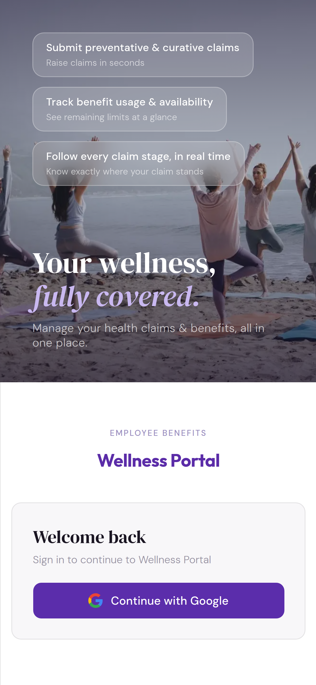 | 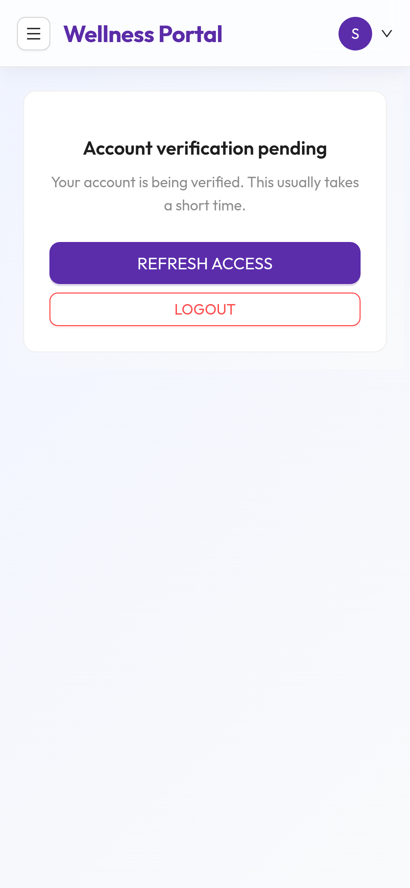 | 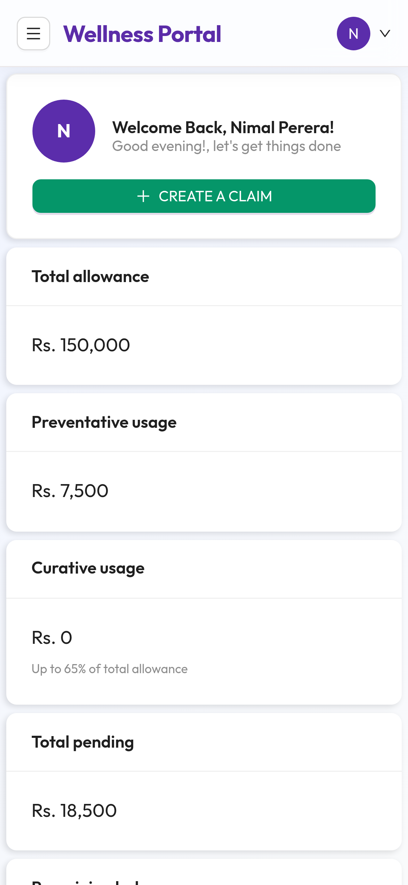 |

|                        Balance & my claims                         |                        Create a claim                        |                      Navigation drawer                      |
| :----------------------------------------------------------------: | :----------------------------------------------------------: | :---------------------------------------------------------: |
| 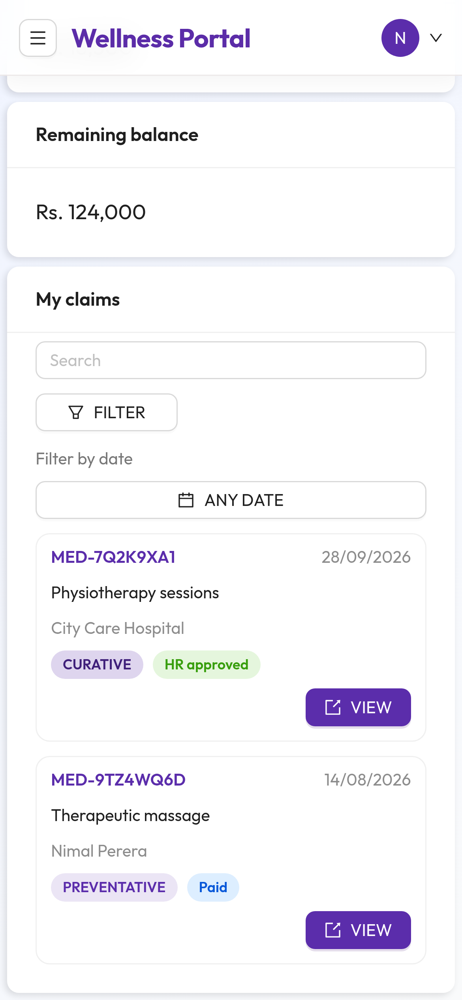 | 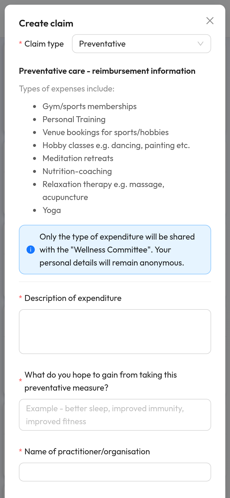 | 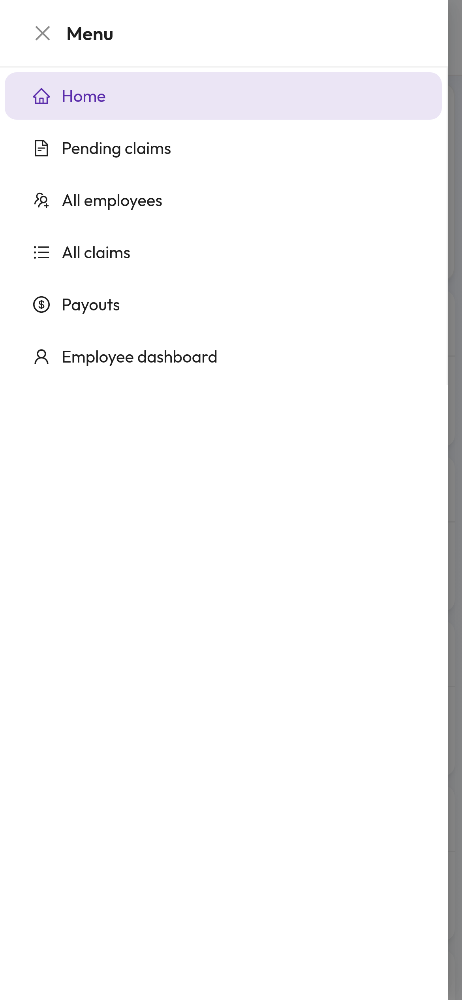 |

|                          Finance dashboard                           |                     Pending claims (card view)                     |                        Review & approve                         |
| :------------------------------------------------------------------: | :----------------------------------------------------------------: | :-------------------------------------------------------------: |
| 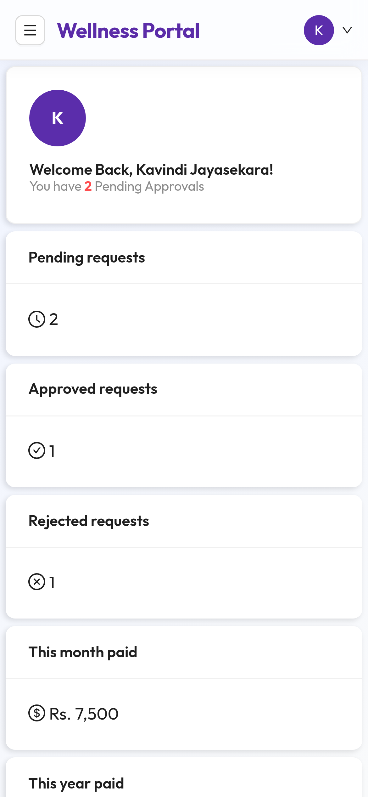 | 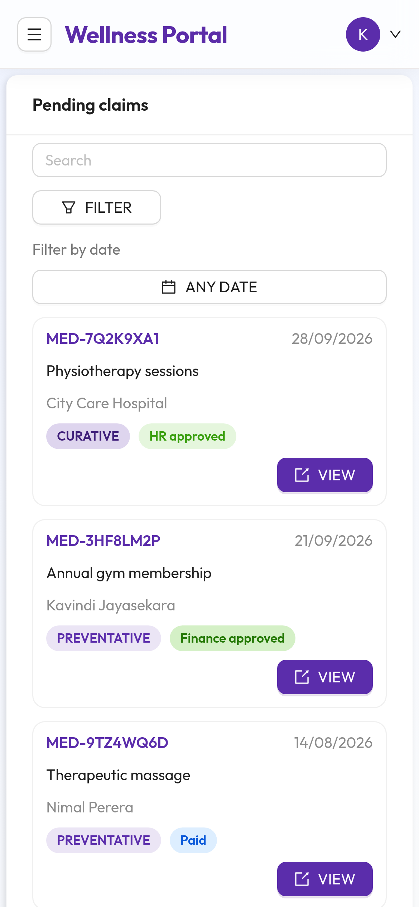 | 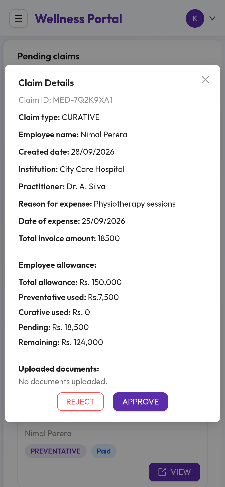 |

|                       All employees' balances                        |                  Super admin: user management                  |
| :------------------------------------------------------------------: | :------------------------------------------------------------: |
| 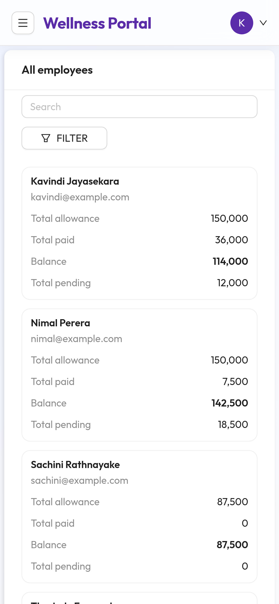 | 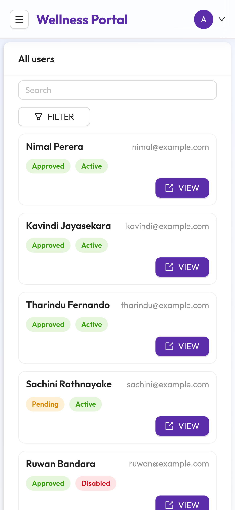 |

---

## 🧰 Tech Stack

| Layer                  | Technology                                                                                                   |
| ---------------------- | ------------------------------------------------------------------------------------------------------------ |
| **Frontend**           | React 19, TypeScript, Vite, Ant Design 6, Redux Toolkit, React Router 7, SCSS, Tailwind, `@ant-design/plots` |
| **Backend**            | Node.js 20 on AWS Lambda, TypeScript, AWS SDK v3, Zod validation                                             |
| **API**                | Amazon API Gateway (REST) with a Cognito User Pool authorizer                                                |
| **Auth**               | Amazon Cognito (User Pool + Identity Pool), Google Workspace federation, Cognito triggers                    |
| **Database**           | Amazon DynamoDB (on-demand), single-table-style key design with GSIs                                         |
| **File storage**       | Amazon S3: a temporary upload bucket and a permanent documents bucket, both private, with presigned URLs     |
| **Email**              | Amazon SES with DKIM, SPF and a custom MAIL FROM domain (DNS records in Route 53)                            |
| **Scheduling**         | Amazon EventBridge (cron) for the yearly allowance rollover                                                  |
| **Hosting**            | S3 + CloudFront (Origin Access Identity, HTTPS-only), custom domain via Route 53 and ACM                     |
| **Config & secrets**   | SSM Parameter Store, Secrets Manager                                                                         |
| **Networking**         | Dedicated VPC with private subnets for Lambdas                                                               |
| **IaC**                | Terraform with reusable modules and separate `dev` / `production` environments                               |
| **CI/CD**              | Bitbucket Pipelines with AWS OIDC role assumption (no long-lived keys)                                       |
| **Testing**            | Mocha, Chai, Sinon, nyc (coverage)                                                                           |
| **API docs**           | OpenAPI 3 generated from JSDoc (`swagger-jsdoc`), served with Swagger UI                                     |
| **Dependency hygiene** | Renovate bot, plus a shared security-scan pipeline                                                           |

---

## 🏗️ System Architecture

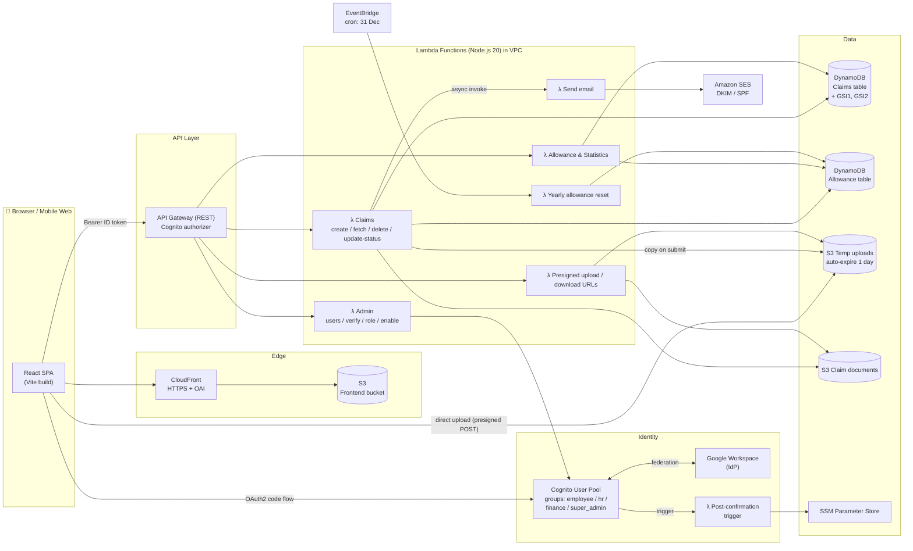

### Design principles

- **Fully serverless and pay-per-use.** No servers to patch. Cost scales to near zero when nobody is using it.
- **One Lambda per responsibility.** Each function has its own least-privilege IAM role, so the email Lambda can't touch DynamoDB and the claims Lambda can't send email directly.
- **Files never pass through Lambda.** The browser uploads straight to S3 with presigned POST URLs. This avoids API Gateway's payload limit, avoids paying Lambda time for uploads, and makes uploads faster on mobile networks.
- **Side effects are asynchronous.** Emails go out through an async (`InvocationType: Event`) call, so a slow mail server never slows down or breaks claim submission.
- **Same code, separate environments.** `dev` and `production` are separate Terraform stacks built from the same modules.

---

## 🔄 Claim Lifecycle (State Machine)

Status changes are enforced on the **server** by a declarative transition table. Each state lists which roles may move a claim and which states they may move it to. Any other change returns `409 Conflict`.

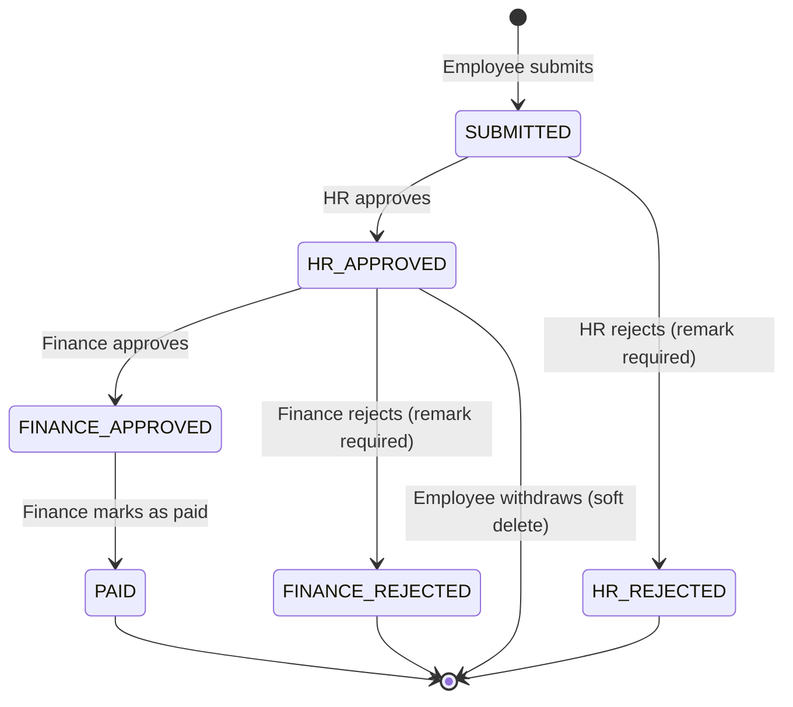

```ts
// Simplified version of the transition table
const CLAIM_TRANSITIONS = {
  SUBMITTED: {
    allowed_roles: ["HR"],
    allowed_statuses: ["HR_APPROVED", "HR_REJECTED"],
  },
  HR_APPROVED: {
    allowed_roles: ["FINANCE"],
    allowed_statuses: ["FINANCE_APPROVED", "FINANCE_REJECTED"],
  },
  FINANCE_APPROVED: { allowed_roles: ["FINANCE"], allowed_statuses: ["PAID"] },
  HR_REJECTED: EMPTY,
  FINANCE_REJECTED: EMPTY,
  PAID: EMPTY, // terminal states
};
```

How each transition moves money:

| Transition         | Effect on the allowance                            |
| ------------------ | -------------------------------------------------- |
| Claim created      | `pending += amount`                                |
| → `PAID`           | `pending -= amount`, `used += amount`              |
| → `*_REJECTED`     | `pending -= amount` (money returns to the balance) |
| Employee withdraws | `pending -= amount`, and the claim is soft-deleted |

---

## 🔁 Key Flows

### 1. Submitting a claim with documents

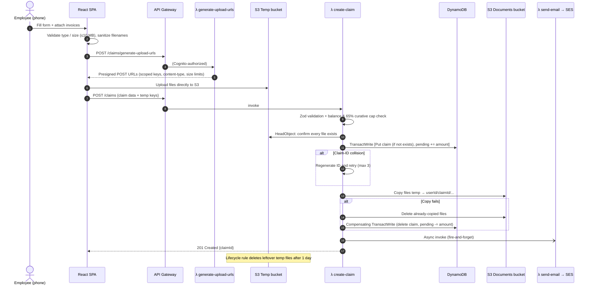

Why two buckets? Users often abandon forms halfway. Uploads land in a **temp bucket that empties itself automatically**, and files move into the permanent documents bucket only after the claim is committed. That keeps the documents bucket clean and makes it easy to audit.

### 2. Sign-up, verification and roles

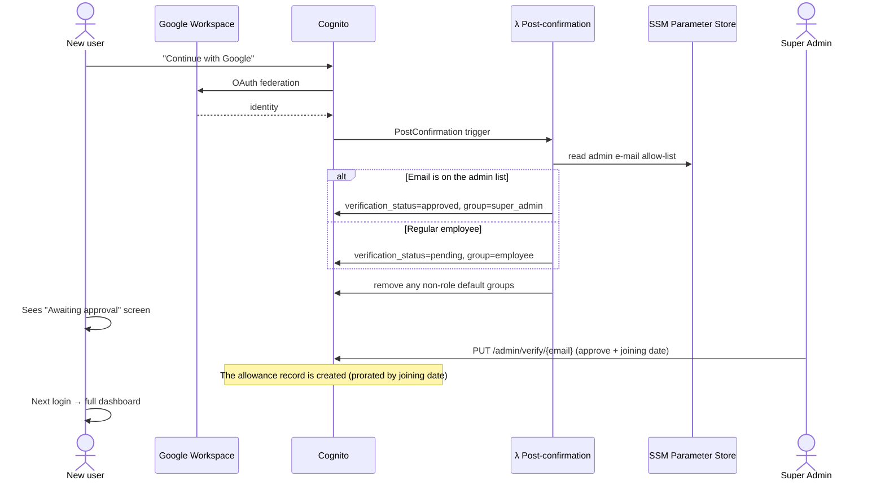

### 3. Yearly allowance rollover

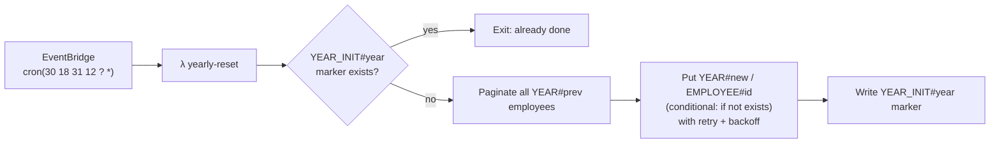

The job is **idempotent** at two levels: a year-level marker record, and conditional writes for each employee. If it runs twice or crashes halfway, re-running it is safe.

---

## 🗄️ Data Model: DynamoDB Design

The data model starts from the queries the app needs and builds the keys around them.

### Claims table

| Key                 | Pattern                                   | Serves                                                   |
| ------------------- | ----------------------------------------- | -------------------------------------------------------- |
| `PK`                | `CLAIM#<claimId>`                         | Get one claim by ID                                      |
| `GSI1PK` / `GSI1SK` | `EMPLOYEE#<userId>` / `DATE#<yyyy-mm-dd>` | "My claims", newest first, with date ranges              |
| `GSI2PK` / `GSI2SK` | `STATUS#<status>` / `DATE#<yyyy-mm-dd>`   | HR / Finance queues by status, with date-range `BETWEEN` |

The status and the `GSI2PK` field are updated in the **same** write, so a claim moves between queues atomically. Claims use **soft delete** (`is_deleted`) to keep an audit trail.

### Allowance table

| Key                                | Pattern                                                                                                            | Meaning                             |
| ---------------------------------- | ------------------------------------------------------------------------------------------------------------------ | ----------------------------------- |
| `PK`                               | `YEAR#<yyyy>`                                                                                                      | Allowance year                      |
| `SK`                               | `EMPLOYEE#<userId>`                                                                                                | One row per employee per year       |
| attrs                              | `total_allowance`, `preventative_used`, `curative_used`, `preventative_pending`, `curative_pending`, `joined_date` | Running balances                    |
| `PK=YEAR_INIT#<yyyy>`, `SK=SYSTEM` | marker                                                                                                             | Idempotency for the yearly rollover |

Keying by year means **"all employees for 2026" is a single Query**. That one query powers the Finance "All employees" screen, and history from earlier years is kept for free.

---

## 📐 Business Rules

```ts
// Remaining balances (simplified)
curativeMax = floor(total * 0.65);
consumed = used + pending; // pending money is reserved
remainingTotal = max(0, total - consumed);
remainingCurative = min(max(0, curativeMax - curativeConsumed), remainingTotal);
```

- **Pending money counts as spent**, so an employee can't submit several claims that together go over the balance.
- **Prorated first year:** `floor(annual / 12 × months remaining)` from the joining month. Anyone who joined in an earlier year gets the full amount.
- **Rejecting needs a reason**, and remarks are _only_ accepted on rejections. Both rules are checked on the server.
- Employees can only withdraw **their own** claims, and only while the claim is still waiting for Finance.

---

## 🔐 Security

| Concern             | Approach                                                                                                                                                                 |
| ------------------- | ------------------------------------------------------------------------------------------------------------------------------------------------------------------------ |
| Authentication      | Cognito + Google Workspace SSO (OAuth2 authorization-code flow); ID token sent as a Bearer token                                                                         |
| Authorization (API) | API Gateway Cognito authorizer **plus** in-Lambda role checks against `cognito:groups` and a custom `verification_status` claim                                          |
| Authorization (UI)  | `ProtectedRoute` with role-based route config; unverified users are always sent to `/waiting`                                                                            |
| Least privilege     | A separate IAM role per Lambda; separate Identity Pool roles per Cognito group                                                                                           |
| Files               | Private buckets, short-lived presigned URLs, per-user/per-claim key prefixes, type and size limits enforced at upload time                                               |
| Frontend hosting    | S3 is reachable only through CloudFront (OAI), with HTTPS redirect and TLS 1.2+ on the custom domain                                                                     |
| Data integrity      | DynamoDB `TransactWrite` + `ConditionExpression`s guard against double-processing and race conditions                                                                    |
| CI credentials      | **OIDC federation** from Bitbucket to AWS: no stored access keys, short-lived credentials for each run                                                                   |
| Email trust         | SES domain identity with DKIM, SPF and a custom MAIL FROM domain                                                                                                         |
| Input validation    | Zod schemas plus typed validators on every write endpoint; consistent typed error classes (`ValidationError`, `ConflictError`, `ForbiddenError`…) that map to HTTP codes |
| Supply chain        | Renovate for dependency updates; a shared security-scan pipeline                                                                                                         |

---

## 🧱 Infrastructure as Code

Every AWS resource is defined in Terraform. Nothing is clicked together by hand in the console.

```
infra/terraform/
├── bootstrap/            # remote state bucket + lock (run once)
├── modules/              # reusable building blocks
│   ├── api_gateway/      # REST API, nested resources, CORS, gateway responses
│   ├── cognito/          # user pool, Google IdP, groups, identity pool, IAM roles
│   ├── lambda/           # function + role + log group (shared by all functions)
│   ├── dynamodb/         # tables + GSIs
│   ├── s3 / s3_temp / s3_frontend / s3_docs / s3_api_docs
│   ├── ses/  route53/  event-bridge/  ssm-config/  vpc/  subnets/
└── environments/
    ├── dev/              # wires the modules together for dev
    └── production/       # same modules, production config
```

- **17 Lambda functions** and **18 API routes** are declared from a single list of `{ path, method, lambda, auth }` entries. Adding an endpoint means adding one entry.
- `moved.tf` blocks let us refactor the Terraform without destroying and recreating live resources.

---

## 🚀 CI/CD Pipeline

```mermaid
flowchart LR
    Dev(["Push / manual trigger"]) --> T["Backend: npm ci → build →<br/>generate OpenAPI → tests"]
    T --> FB["Frontend: build with<br/>env checks"]
    FB --> OIDC["Assume AWS role<br/>via OIDC"]
    OIDC --> Plan["terraform plan"]
    Plan --> Bk["📦 On-demand DynamoDB<br/>backup of both tables"]
    Bk --> Apply["terraform apply"]
    Apply --> Inv["CloudFront invalidation"]
    Inv --> Smoke["Smoke test: GET /health"]
```

Production safeguards:

- **Branch guard:** production deploys only run from `develop`
- **Plan-only pipeline**, so a production change can be reviewed before anything is applied
- **Automatic DynamoDB backups before every apply**, tagged with the commit SHA, for point-in-time rollback
- Pipelines **fail fast** when required variables (Cognito config, role ARN, region) are missing
- **Post-deploy smoke test** against the live health endpoint

---

## 🔌 API Surface

| Method | Path                             | Who                  | Purpose                                                                   |
| ------ | -------------------------------- | -------------------- | ------------------------------------------------------------------------- |
| GET    | `/`                              | Public               | Health check                                                              |
| POST   | `/claims/generate-upload-urls`   | Employee             | Presigned POST URLs for documents                                         |
| POST   | `/claims`                        | Employee             | Submit a claim                                                            |
| GET    | `/claims`                        | All roles            | List claims (self-scope for employees; filters: status, type, date range) |
| GET    | `/claims/{id}`                   | Owner / HR / Finance | Claim details                                                             |
| GET    | `/claims/status/{status}`        | HR / Finance         | Status queue                                                              |
| GET    | `/employees/{id}/claims`         | HR / Finance         | One employee's claims                                                     |
| PATCH  | `/claims/{id}`                   | HR / Finance         | Status change (validated by the state machine)                            |
| DELETE | `/claims/{id}`                   | Owner                | Withdraw a claim (soft delete + release pending money)                    |
| POST   | `/claims/generate-download-urls` | Authorized           | Presigned GET URLs to view attachments                                    |
| GET    | `/allowance`                     | Employee             | My balances                                                               |
| GET    | `/employees/{id}/allowance`      | HR / Finance         | An employee's balances                                                    |
| GET    | `/employees`                     | Finance              | Year summary of all employees                                             |
| GET    | `/statistics`                    | HR / Finance         | Role-aware dashboard stats and monthly payout totals                      |
| GET    | `/admin/users`                   | Super admin          | List users                                                                |
| PUT    | `/admin/verify/{email}`          | Super admin          | Approve or reject a sign-up                                               |
| PUT    | `/admin/group/{email}`           | Super admin          | Change role                                                               |
| POST   | `/admin/account-status/{email}`  | Super admin          | Enable or disable an account                                              |

All endpoints are documented with OpenAPI 3. The spec is generated from JSDoc annotations in CI and published as a Swagger UI site.

---

## 🧪 Testing & Quality

- **169 unit tests** (Mocha + Chai + Sinon) covering claim validation, state-machine transitions, allowance calculation, admin validators, and the create and fetch handlers with mocked AWS clients
- Tests run on **every pipeline**, and a failing test blocks deployment
- Strict TypeScript across the frontend and backend
- ESLint on the frontend
- Structured JSON logging with a `requestId` in every log line, which makes tracing in CloudWatch straightforward

---

## 🧠 Engineering Challenges & How We Solved Them

**1. Keeping balances correct under concurrency.**
Two Finance users clicking "Paid" at the same moment, or a claim submitted while another is being rejected, could easily corrupt a balance. Every money-moving action is a **DynamoDB transaction** that updates the claim and the allowance row together, with conditions such as `#status = :currentStatus` and `pending >= :amount`. If anything has changed in the meantime, the whole transaction is cancelled and the user gets a friendly "status already changed, please refresh" (409).

**2. Distributed writes across S3 and DynamoDB.**
DynamoDB transactions can't include S3. Submitting a claim therefore follows a **saga-style** sequence: commit the DB transaction, copy the files, and if the copy fails, delete the partially copied files and run a **compensating transaction**. The system never ends up with a claim whose documents are missing.

**3. Unique, human-readable claim IDs without a counter.**
IDs look like `MED-7Q2K9XA1`. Instead of a central counter (a hotspot and a single point of failure), IDs are random. An `attribute_not_exists(PK)` condition catches the rare collision, and the code retries up to 3 times.

**4. A scheduled job that must never double-apply.**
The yearly rollover runs once a year, so a bug there is costly. It uses a year-level marker and conditional writes for each employee, so **re-running it is always safe**, and it retries with backoff on throttling.

**5. Uploads on mobile.**
Phone photos are big (and often HEIC). Direct-to-S3 presigned POSTs, client-side checks and HEIC/HEIF support make uploads fast and reliable on mobile data, without Lambda's payload limits getting in the way.

**6. Safe production deploys.**
Deploys run with OIDC and short-lived credentials, a plan-only review pipeline, automatic DynamoDB backups before each apply, a branch guard and post-deploy smoke tests, so a deploy can't silently break production data.

---

## 👨‍💻 My Role

I worked as a **full-stack / cloud engineer** in a small team and was the **top contributor to the codebase** (~600 of ~1,160 commits, Feb–Sep 2026). My work covered the following:

- Designing and implementing serverless **backend Lambdas** (claims, allowance, statistics, admin, email)
- **DynamoDB data modelling** and the transactional balance logic
- The **claim state machine** and server-side authorization
- **Terraform** modules and environments (dev → production), plus the Bitbucket **CI/CD** pipeline with OIDC
- **Cognito / Google SSO** integration and the user verification flow
- **React frontend** features and the mobile-responsive UI
- Unit tests and OpenAPI documentation

<!-- Edit the list above to match exactly what you personally owned. -->

---

## 🖥️ Desktop Screenshots

|                           Employee dashboard                           |
| :--------------------------------------------------------------------: |
| 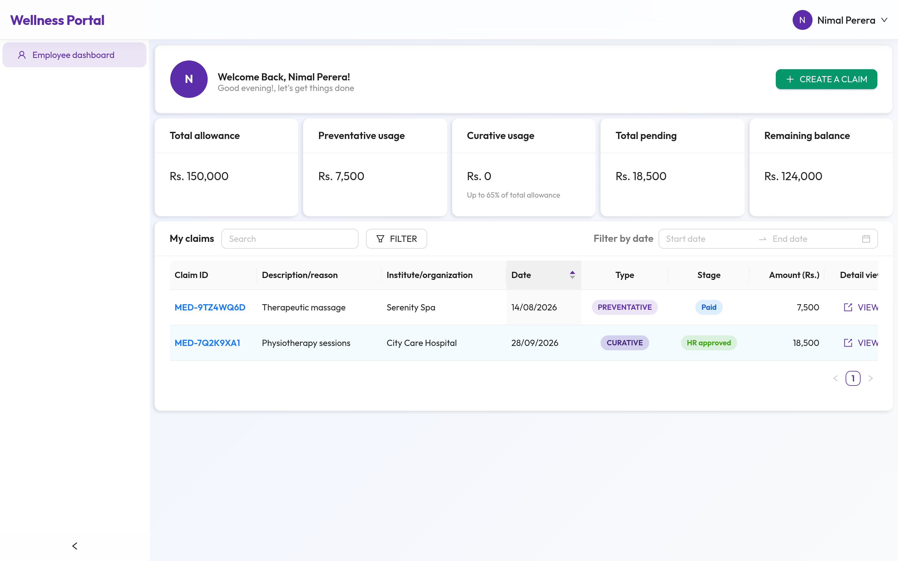 |

|                  Finance dashboard: monthly payouts                   |
| :-------------------------------------------------------------------: |
| 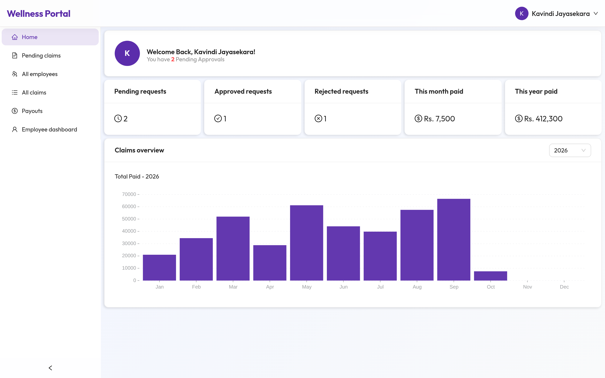 |

|                          Finance: all claims                           |
| :--------------------------------------------------------------------: |
| 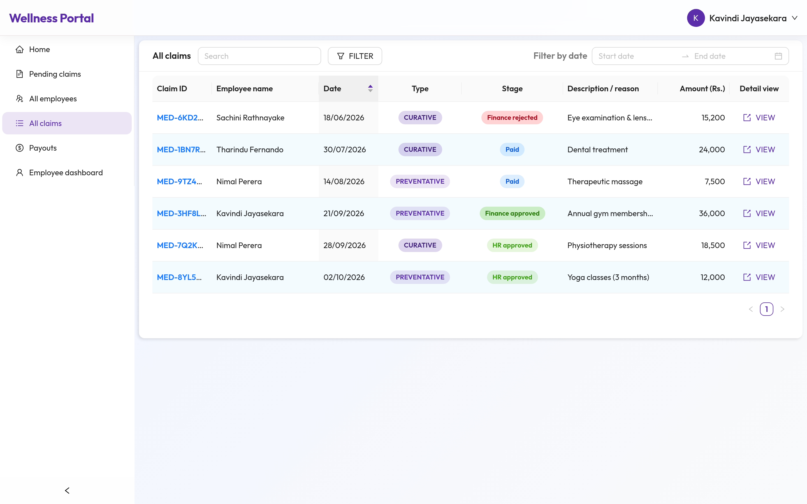 |

|                  Super admin: user management                   |
| :-------------------------------------------------------------: |
| 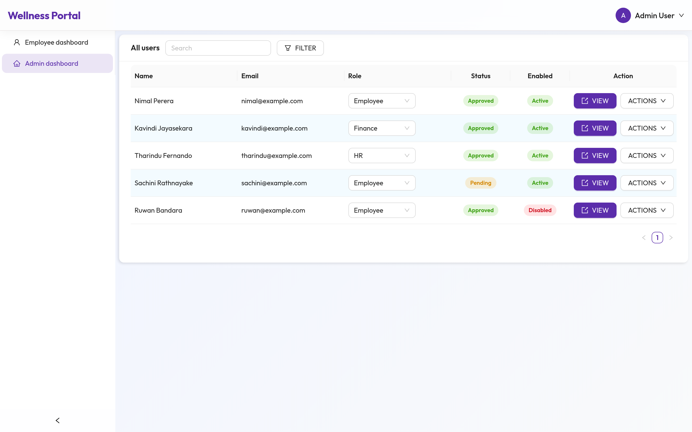 |

---

<sub>All names, emails, amounts and claim IDs in the screenshots are fictional. This repository contains no proprietary source code.</sub>
